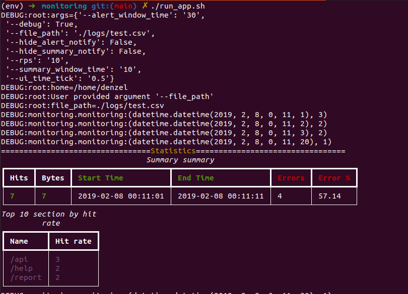

> app view



## APP Requirements

- Python 3.8+
- docopt
- yapf
- rich
- pytest

```
HTTP log monitoring console program:

Read a CSV-encoded HTTP access log (attached to email). It should either
take the file as a parameter or read from standard input. All time-based
calculations should be relative to the timestamps in the log-file. Avoid using
system time in your program.

Example log file (first line is the header):
"remotehost","rfc931","authuser","date","request","status","bytes"
"10.0.0.1","-","apache",1549574332,"GET /api/user HTTP/1.0",200,1234
"10.0.0.4","-","apache",1549574333,"GET /report HTTP/1.0",200,1136
"10.0.0.1","-","apache",1549574334,"GET /api/user HTTP/1.0",200,1194

"10.0.0.4","-","apache",1549574334,"POST /report HTTP/1.0",404,1307
```

## Installation

- `git clone` or download the project `monitoring` app && `cd monitoring`
- **Optional step**. Create python env `pip install virtualenv && python3.8 -m venv env && source env/bin/activate`
- Install requirements `python -m pip install -r requirements.txt`

## Usage

- The full list of available options is stored in the main.py root file
- Run app bash script `./run_app.py`

## How to test app

- Run a bash script to create log stream. Command in the main dir of app `./run_log_stream.sh`
- Open the second terminal in the same work dir. Run app bash script  `./run_app.py`
- `./run_log_stream.sh` start periodically adding new logs to the file, the number of rounds and the number of logs is configurable (see the file docs)

## Running tests

- `./run_tests.sh`

## App structure

- `monitoring`: stores the main app code base
- `monitoring.monitoring.py`:
  - `class Monitoring` encapsulates handling stream of logs.
  - `class SummaryNotification` encapsulates summary custom notification logic for the specified log interval
  - `class AlertNotification` encapsulates alert custom notification logic for the specified log interval
- `monitoring.log.py`: Class encapsulates Log entity and min log window LogWindow(1sec log, hold the number of request per sec)
- `monitoring.timeline.py`: Class encapsulates the timeline equal to the size `window_size` and contains list of the request per sec
- `monitoring.utils.py`: utils for auto generation logs(check file description for understanding input params)
- `tests`: stores app tests

## Improvements

- Improve test coverage for `Monitoring.py`, and add tests for the real-time streaming process. For that need to create a background process which will push periodically logs in the file
- A cold start on huge datasets with a huge number of requests per second (RPS) can take some time until the log timeline is created. The solution would be to extend `Log.process_log` function and read the file until we don't fill the log window and then startup the streaming process.
- Reduce the number of the information stored in the `class AlertNotification` override the method `TimeLine.append`
- Build and run with the Docker
